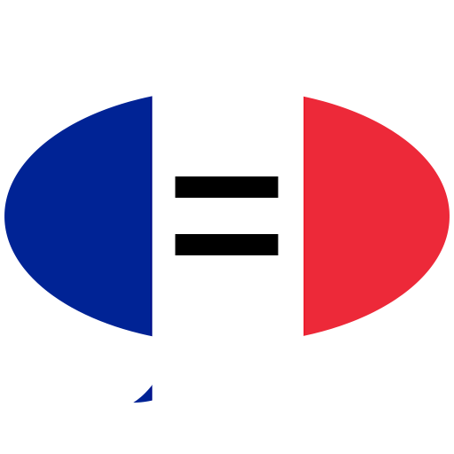

<h1 align="center">
  	<a href="https://frenchhomophones.herokuapp.com/">
		
		 
	 	🇫🇷 frenchhomophones
</h1>

<h4 align="center">
	Flask web application that lists homophones of the French language.
</h4>

<h5 align="center">

  

</h5>

## ℹ About

This is a small Flask web application I built during 2019-2020 summer vacation.
My inspiration was <a href="https://www.homophone.com/">this website</a>, which showed me interesting English homophones from time to time; I used it as my homepage (on random) until I created my own, for French!

I crawled through <a href ="https://en.wiktionary.org/w/index.php?title=Category:French_terms_with_homophones">Wiktionary's category of French homophones</a> with <a href="https://pypi.org/project/beautifulsoup4/">BeautifulSoup</a> and parsed words URLs entries with <a href="https://pypi.org/project/wiktionaryparser/">WiktionaryParser</a>. Thus, I had successfully extracted meaning from Wiktionary, I just had to create a database and a web application for it.

SQL solutions are limited to 10k rows on Heroku (Wiktionary has almost 60k french homophones listed), so I went with MongoDB at mLab/Atlas, which offers 0.5GB storage for free and is easy enough to integrate with Heroku.

Flask extended with PyMongo was enough to carry out database connection and the web application's core. I planned the website design with pen and paper before coding it out using HTML (powered by Jinja2), and CSS (Bootstrap).

## 🏡 Running locally

First, clone the repository and create a virtual environment for the project (to ensure you won't have problems with your libraries versions). Using `pipenv`:

`pipenv install` - Create virtual environment and install dependencies

`pipenv shell` - Activate virtual environment

Most of the website's functionality depends on being connected to a MongoDB database. If you wish to use your own database, just set the `MONGO_URI` environment variable in the `.env.example` file to your database URI connection string and rename the `.env.example` file to `.env`; alternatively, set `MONGO_URI` as an environment variable of the system hosting the application.

With everything set, you can boot the flask app with `flask run` and access it through `http://localhost:5000`. Flask should reload the application every time a `.py` file relevant to the project is changed.
